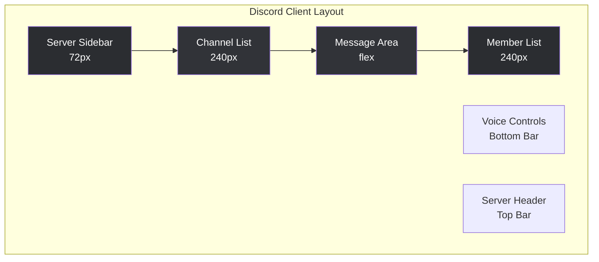

# 🎮 Discord Client - Visual Control Panel

## نظرة عامة على الهيكل

```
┌─────────────────────────────────────────────────────────────────────────────┐
│                         DISCORD CLIENT ARCHITECTURE                         │
├─────────────────────────────────────────────────────────────────────────────┤
│                                                                             │
│  ┌──────────────┐  ┌──────────────┐  ┌──────────────┐  ┌──────────────┐   │
│  │   SERVER     │  │   CHANNELS   │  │    MESSAGES  │  │    MEMBER    │   │
│  │   SIDEBAR    │  │    LIST      │  │     AREA     │  │     LIST     │   │
│  │  (72px)      │  │   (240px)    │  │   (flex)     │  │   (240px)    │   │
│  └──────────────┘  └──────────────┘  └──────────────┘  └──────────────┘   │
│                                                                             │
│  ┌──────────────────────────────────────────────────────────────────────┐   │
│  │                         MAIN CONTENT AREA                           │   │
│  │                                                                      │   │
│  │  ┌─────────────────────────────────────────────────────────────┐   │   │
│  │  │  Server Header (Server Name, Settings, Members Count)       │   │   │
│  │  ├─────────────────────────────────────────────────────────────┤   │   │
│  │  │                                                              │   │   │
│  │  │              Message List (Scrollable)                      │   │   │
│  │  │                                                              │   │   │
│  │  │  ┌─────────┐ ┌─────────┐ ┌─────────┐                        │   │   │
│  │  │  │ Message │ │ Message │ │ Message │  ...                   │   │   │
│  │  │  │   #1    │ │   #2    │ │   #3    │                        │   │   │
│  │  │  └─────────┘ └─────────┘ └─────────┘                        │   │   │
│  │  │                                                              │   │   │
│  │  ├─────────────────────────────────────────────────────────────┤   │   │
│  │  │  Message Input (TextArea + Send Button + Emoji Picker)     │   │   │
│  │  └─────────────────────────────────────────────────────────────┘   │   │
│  └──────────────────────────────────────────────────────────────────────┘   │
│                                                                             │
│  ┌──────────────────────────────────────────────────────────────────────┐   │
│  │                         VOICE CONTROLS                               │   │
│  │   [🎤 Mute] [🎧 Deafen] [📞 Disconnect] [⚙️ Settings]                │   │
│  └──────────────────────────────────────────────────────────────────────┘   │
│                                                                             │
└─────────────────────────────────────────────────────────────────────────────┘
```

## API Endpoints المطلوبة

### 1. Guilds (السيرفرات)
```typescript
GET  /users/@me/guilds              // قائمة السيرفرات
GET  /guilds/:guildId              // تفاصيل السيرفر
GET  /guilds/:guildId/channels     // قنوات السيرفر
GET  /guilds/:guildid/members       // أعضاء السيرفر (مع limit)
GET  /guilds/:guildId/roles        // رولات السيرفر
```

### 2. Channels (القنوات)
```typescript
GET  /channels/:channelId          // تفاصيل القناة
GET  /channels/:channelId/messages // رسائل القناة
POST /channels/:channelId/messages // إرسال رسالة
DELETE /channels/:channelId/messages/:messageId // حذف رسالة
```

### 3. Direct Messages
```typescript
GET  /users/@me/channels            // قائمة DM
POST /users/@me/channels            // إنشاء DM جديد
GET  /channels/:channelId/messages  // رسائل DM
POST /channels/:channelId/messages  // إرسال DM
```

### 4. Voice
```typescript
GET  /guilds/:guildId/voice-states  // حالات الصوت
POST /guilds/:guildId/voice-states  // الانضمام للصوت (عبر selfbot)
DELETE /guilds/:guildId/voice-states/:userId // مغادرة الصوت
```

## Components Structure

```
client/src/
├── pages/
│   └── DiscordClient.tsx          // الصفحة الرئيسية
│
├── components/
│   └── discord/
│       ├── DiscordSidebar.tsx     // قائمة السيرفرات
│       ├── ChannelList.tsx        // قائمة القنوات
│       ├── ChannelCategory.tsx    // تصنيف القنوات
│       ├── MessageArea.tsx        // منطقة الرسائل
│       ├── Message.tsx            // رسالة منفردة
│       ├── MessageInput.tsx       // إدخال الرسائل
│       ├── MemberList.tsx         // قائمة الأعضاء
│       ├── MemberItem.tsx         // عضو منفرد
│       ├── DirectMessages.tsx     // الرسائل الخاصة
│       ├── RoleManager.tsx        // إدارة الرولات
│       ├── VoiceControls.tsx      // عناصر التحكم بالصوت
│       ├── UserProfile.tsx        // ملف المستخدم
│       └── ServerSettings.tsx     // إعدادات السيرفر
│
├── hooks/
│   ├── useDiscordClient.ts        // Hook رئيسي للعميل
│   ├── useGuilds.ts               // إدارة السيرفرات
│   ├── useChannels.ts             // إدارة القنوات
│   ├── useMessages.ts             // إدارة الرسائل
│   ├── useMembers.ts              // إدارة الأعضاء
│   ├── useVoice.ts                // إدارة الصوت
│   └── useWebSocket.ts            // اتصال WebSocket
│
└── lib/
    ├── discord-client.ts          // عميل Discord API
    ├── discord-types.ts           // TypeScript Types
    └── discord-utils.ts           // أدوات مساعدة
```

## UI Layout



## State Management

```typescript
interface DiscordClientState {
  // Connection
  token: string | null;
  isConnected: boolean;
  user: DiscordUser | null;
  
  // Guilds
  guilds: Guild[];
  selectedGuildId: string | null;
  
  // Channels
  channels: Channel[];
  selectedChannelId: string | null;
  
  // Messages
  messages: Map<string, Message[]>;
  messageCache: LRUCache;
  
  // Members
  members: Map<string, Member[]>;
  onlineMembers: Member[];
  
  // Voice
  voiceState: VoiceState | null;
  voiceChannel: VoiceChannel | null;
  
  // DM
  dms: DMChannel[];
  selectedDmId: string | null;
  
  // Real-time
  wsConnected: boolean;
  typingUsers: Map<string, User[]>;
}
```

## Features Priority

### Phase 1 - Core (Essential)
1. ✅ Server List Sidebar
2. ✅ Channel List with categories
3. ✅ Message display and sending
4. ✅ Member list
5. ✅ DM/Private messages

### Phase 2 - Advanced
6. ✅ Role management display
7. ✅ Voice channel display
8. ✅ Voice join/leave controls
9. ✅ Real-time message updates (WebSocket)

### Phase 3 - Complete
10. ✅ Server settings
11. ✅ User profile modals
12. ✅ Message reactions
13. ✅ Embed parsing
14. ✅ File attachments display

## Implementation Notes

### Discord API Rate Limits
- 50 requests per second globally
- Use caching for frequently accessed data
- Implement request queuing

### WebSocket Events to Handle
- `MESSAGE_CREATE` - New messages
- `MESSAGE_UPDATE` - Edited messages
- `MESSAGE_DELETE` - Deleted messages
- `TYPING_START` - User typing
- `VOICE_STATE_UPDATE` - Voice changes
- `GUILD_MEMBER_UPDATE` - Member updates
- `CHANNEL_UPDATE` - Channel changes

### Performance Considerations
- Virtual scrolling for messages (100+ messages)
- Lazy loading for member list
- Image lazy loading with blur placeholders
- Message pagination (50 per request)
