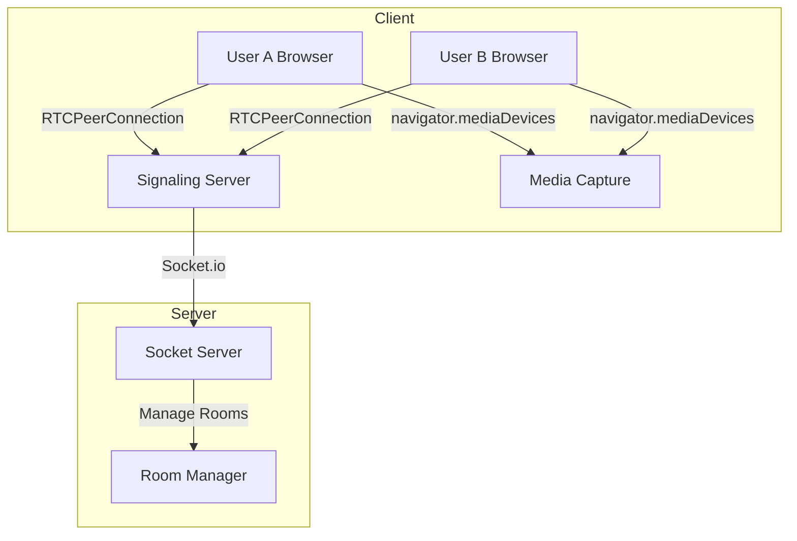

# Discord Control Panel Enhancement Plan

## Overview
This document outlines the comprehensive plan for enhancing the Visual Discord Control Panel with 5 major systems.

---

## System 1: Voice Channels System (WebRTC + Socket.io)

### Architecture


### Database Schema
```javascript
// voice_rooms table
{
  id: UUID PRIMARY KEY,
  guild_id: String,
  channel_id: String,
  room_name: String,
  max_users: Number DEFAULT 0,
  created_at: Timestamp,
  is_active: Boolean
}

// voice_participants table
{
  id: UUID PRIMARY KEY,
  room_id: UUID FK,
  user_id: String,
  socket_id: String,
  joined_at: Timestamp,
  is_speaking: Boolean DEFAULT false,
  audio_enabled: Boolean DEFAULT true
}
```

### Key Features
1. **Server-side (Socket.io)**
   - Signaling server for WebRTC handshake
   - Room management (create/join/leave)
   - ICE candidate exchange
   - Speaking detection via audio analysis
   - Mute/deafen controls

2. **Client-side**
   - `navigator.mediaDevices.getUserMedia()` for mic access
   - RTCPeerConnection for peer-to-peer audio
   - Speaking indicator (visual feedback)
   - Participant list UI

### API Endpoints
- `POST /api/voice/create-room` - Create voice room
- `POST /api/voice/join-room` - Join voice room
- `POST /api/voice/leave-room` - Leave voice room
- `POST /api/voice/mute` - Mute user

---

## System 2: Roles & Permissions System

### Database Schema
```javascript
// roles table
{
  id: UUID PRIMARY KEY,
  guild_id: String,
  name: String,
  color: String HEX,
  position: Number, // Hierarchy (higher = more power)
  permissions: JSON Array,
  is_everyone: Boolean DEFAULT false,
  created_at: Timestamp
}

// permissions enum
const Permissions = [
  'SEND_MESSAGES',
  'MANAGE_CHANNELS',
  'MANAGE_ROLES',
  'KICK_MEMBERS',
  'BAN_MEMBERS',
  'VIEW_AUDIT_LOG',
  'MANAGE_GUILD',
  'MUTE_MEMBERS',
  'DEAFEN_MEMBERS',
  'MOVE_MEMBERS'
]
```

### Middleware Logic
```javascript
// Permission hierarchy check
function canManageRole(actorRole, targetRole) {
  // Higher position can only be managed by even higher
  return actorRole.position > targetRole.position;
}

// Permission check
function hasPermission(role, permission) {
  return role.permissions.includes(permission);
}
```

### Key Features
1. Role CRUD operations
2. Role hierarchy enforcement
3. Permission array per role
4. Role assignment to users
5. Permission check middleware

---

## System 3: User Profiles & Status System

### Database Schema
```javascript
// profiles table
{
  id: UUID PRIMARY KEY,
  user_id: String UNIQUE,
  avatar: String URL,
  banner: String URL,
  bio: String,
  background_color: String HEX,
  created_at: Timestamp,
  updated_at: Timestamp
}

// presence table
{
  id: UUID PRIMARY KEY,
  user_id: String,
  guild_id: String,
  status: Enum['online', 'idle', 'dnd', 'offline'],
  custom_status: String,
  last_changed: Timestamp
}
```

### Key Features
1. Avatar/Banner upload (Cloudinary integration)
2. Real-time presence updates via WebSocket
3. Custom status messages
4. Profile customization (background color, bio)

### WebSocket Events
- `presence:update` - Broadcast status change to all users in guild
- `profile:update` - Broadcast profile changes

---

## System 4: Server Customization & Invites System

### Database Schema
```javascript
// invites table
{
  id: UUID PRIMARY KEY,
  guild_id: String,
  code: String UNIQUE,
  created_by: String,
  created_at: Timestamp,
  expires_at: Timestamp NULLABLE,
  max_uses: Number NULLABLE,
  uses_count: Number DEFAULT 0,
  isPermanent: Boolean DEFAULT true
}

// guild_settings table
{
  guild_id: String PRIMARY KEY,
  name: String,
  icon: String URL,
  banner: String URL,
  description: String,
  verification_level: Number,
  default_message_notifications: Number,
  explicit_content_filter: Number
}
```

### Key Features
1. Unique invite code generation (nanoid)
2. Expiration dates for invites
3. Max uses limit
4. Invite tracking (uses count)
5. Server settings dashboard
6. Server name/icon/banner modification

---

## System 5: Channel Overwrites System

### Database Schema
```javascript
// channel_overwrites table
{
  id: UUID PRIMARY KEY,
  channel_id: String,
  guild_id: String,
  overwrite_type: Enum['role', 'member'],
  overwrite_id: String, // role_id or user_id
  allow: JSON Array, // Permission flags
  deny: JSON Array,  // Permission flags
  created_at: Timestamp,
  updated_at: Timestamp
}
```

### Access Control Logic
```javascript
// Calculate user's channel permissions
async function getChannelPermissions(userId, channelId, guildRoles) {
  const overwrites = await getOverwrites(channelId);
  
  // Start with role permissions
  let permissions = [...defaultPermissions];
  
  // Apply role overwrites
  for (const role of guildRoles) {
    const roleOverwrite = overwrites.find(o => o.overwrite_id === role.id);
    if (roleOverwrite) {
      permissions = applyOverwrite(permissions, roleOverwrite);
    }
  }
  
  // Apply member overwrites (highest priority)
  const memberOverwrite = overwrites.find(
    o => o.overwrite_type === 'member' && o.overwrite_id === userId
  );
  if (memberOverwrite) {
    permissions = applyOverwrite(permissions, memberOverwrite);
  }
  
  return permissions;
}

// Check if user can view channel
async function canUserViewChannel(userId, channelId) {
  const channel = await getChannel(channelId);
  const permissions = await getChannelPermissions(userId, channelId);
  return permissions.includes('VIEW_CHANNEL');
}
```

### Key Features
1. Per-channel permission overwrites
2. Role-based access control (RBAC)
3. Private channels (visible only to specific roles)
4. Permission inheritance
5. Visual permission editor UI

---

## UI/UX Enhancements

### Context Menu Features
- **Server Right-Click Menu:**
  - Server Settings
  - Create Channel
  - Create Role
  - Invite People
  - Leave Server

- **User Right-Click Menu:**
  - View Profile
  - Send Message
  - Mute
  - Deafen
  - Remove Role
  - Kick

### Visual Improvements
- Dark theme (Discord-like background: #313338)
- Profile display with avatar/banner
- Speaking indicators (green ring when speaking)
- Online status badges
- Role color badges

---

## Implementation Priority

1. **Phase 1:** User Profiles & Status (Foundation)
2. **Phase 2:** Roles & Permissions
3. **Phase 3:** Channel Overwrites
4. **Phase 4:** Server Settings & Invites
5. **Phase 5:** Voice Channels (WebRTC)

---

## File Structure

```
server/
  routes/
    voice.js      # Voice channel API
    roles.js      # Roles API
    profiles.js   # Profiles API
    invites.js    # Invites API
    channels.js   # Channel permissions API
  
lib/
  socket.js       # Socket.io handlers
  permissions.js   # Permission logic
  webrtc.js       # WebRTC signaling

client/src/
  components/
    discord/
      VoiceChannel.jsx
      RoleManager.jsx
      ProfileView.jsx
      InviteManager.jsx
      ChannelPermissions.jsx
      ContextMenu.jsx
  hooks/
    useVoice.js
    useRoles.js
    usePresence.js
  lib/
    webrtc.js     # Client WebRTC logic
```
